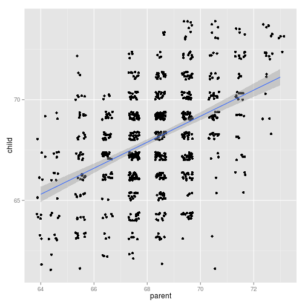

Child's Height Prediction 
========================================================
author: Tianxing Li
date: April 18 2015

Training Data
========================================================

The training data comes from Galton's height data for parents and children.

The data set was used by Galton in 1885 to study the relationship between a parent's height and their childrens.


Training data
========================================================

The data can be loaded with:


```r
library(UsingR)
data(galton)
summary(galton)
```

```
     child           parent     
 Min.   :61.70   Min.   :64.00  
 1st Qu.:66.20   1st Qu.:67.50  
 Median :68.20   Median :68.50  
 Mean   :68.09   Mean   :68.31  
 3rd Qu.:70.20   3rd Qu.:69.50  
 Max.   :73.70   Max.   :73.00  
```


About midparent height
========================================================

The "parent" variable in Galton's data set means the midparent's height is an average of the fathers height and 1.08 times the mother's. 

The app requires both father and mother's height, and then compute the midparent height for prediction.


Model Selection
========================================================

This prediction uses a linear model to predict a child's height based on his/her parents' height.

 


